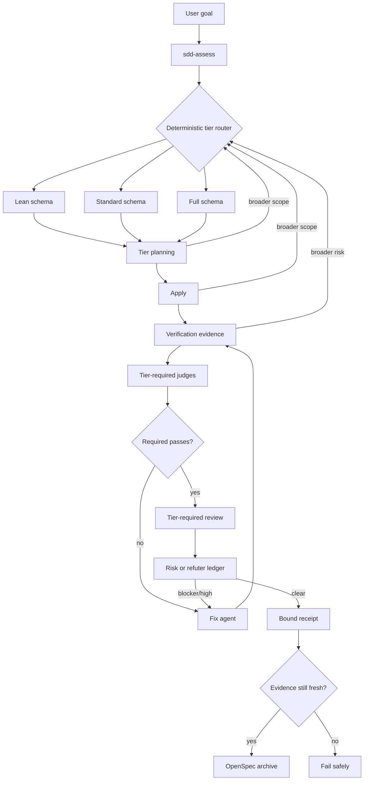

# Architecture

SpecOps separates durable state, deterministic orchestration, and probabilistic
engineering judgment.

## Durable project memory

OpenSpec is the source of truth. Active change artifacts, verification,
judgments, review results, and receipts live beneath `openspec/changes/`.
Archived capability specifications live beneath `openspec/specs/`. Every later
stage obtains fresh OpenSpec instructions and dependencies rather than trusting
the conversation transcript.

`openspec/onboarding.md` is created on first automatic onboarding. Existing
`openspec/config.yaml` files are not overwritten, and an existing default
OpenSpec schema is preserved. SpecOps selects `specops-lean`,
`specops-standard`, or `specops` per change.

## Orchestrator

`.opencode/plugins/sdd-orchestrator.ts` registers the commands and tools. It:

- launches specialist sessions through the OpenCode SDK;
- executes judges and reviewers with `Promise.all`;
- invokes the fix agent when any tier-required judge fails;
- bounds remediation with `automation.max_fix_cycles`;
- runs the pinned OpenSpec CLI without shell interpolation;
- writes only orchestration-owned OpenSpec artifacts;
- refuses oversized or stale review snapshots; and
- archives only after strict validation and a fresh receipt.

The runtime helper is outside `.opencode/plugins/` so OpenCode discovers exactly
one plugin entrypoint.

The plugin does not replace OpenCode's tool layer. Its primary orchestrator
retains the user's configured filesystem, Git, and MCP capabilities. Specialist
sessions inherit the same configured tool catalog unless project policy sets
MCP to `disabled`; their role permissions still limit shell, edits, and nested
delegation.

## Review snapshot

The implementation snapshot includes staged, unstaged, and untracked files.
`openspec/` is excluded so evidence files do not recursively change the reviewed
diff. Text untracked files are represented as new-file patches; binary untracked
files are represented by path and byte size. The snapshot is rejected when it
exceeds the configured byte limit.

The receipt binds:

- the baseline Git commit;
- the implementation diff SHA-256;
- all OpenSpec change artifacts except the receipt itself;
- the selected tier, escalation history, and every judge required by that tier;
- the refuted review ledger; and
- the remediation cycle count.

A commit by a subagent, an implementation edit after review, or an artifact
change after evidence collection makes the receipt stale and blocks archive.

## Runtime observability

`/specops-auto` runs under a dedicated primary controller and dispatches every
specialist through OpenCode's built-in `task` tool. OpenCode therefore owns the
parent/child relationship, renders a native subagent row, and exposes each
transcript through `ctrl+x`, then `down`. Parallel judge and review task calls
are retained as separate selectable workers.

Visible and headless controllers consume the same workflow plans. Model
assessment supplies evidence, while deterministic routing enforces thresholds,
sensitive-risk floors, requested minimums, and monotonic escalation. Active
changes use cumulative `specops-lean`, `specops-standard`, and `specops`
schemas, so escalation adds rigor without discarding earlier artifacts.

Transient provider capacity failures are outside the routing model. The
controller preserves the phase, agent, configured model, prompt, and change ID,
then retries with capped exponential backoff until success or user
interruption. Headless retries are enforced in code; visible retries use the
controller's dedicated wait tool so native subagent transcripts remain
inspectable.

The compact `/specops-auto-headless` runner creates child sessions through the
SDK instead. It reports phase, worker IDs, remediation cycle, and elapsed time
through tool metadata and a repo-local `specops-progress.json`, but OpenCode
1.16 does not promote those custom-tool child sessions into its native subagent
pane. The two modes share the same agents, artifacts, gates, receipt, and
archive safety.
